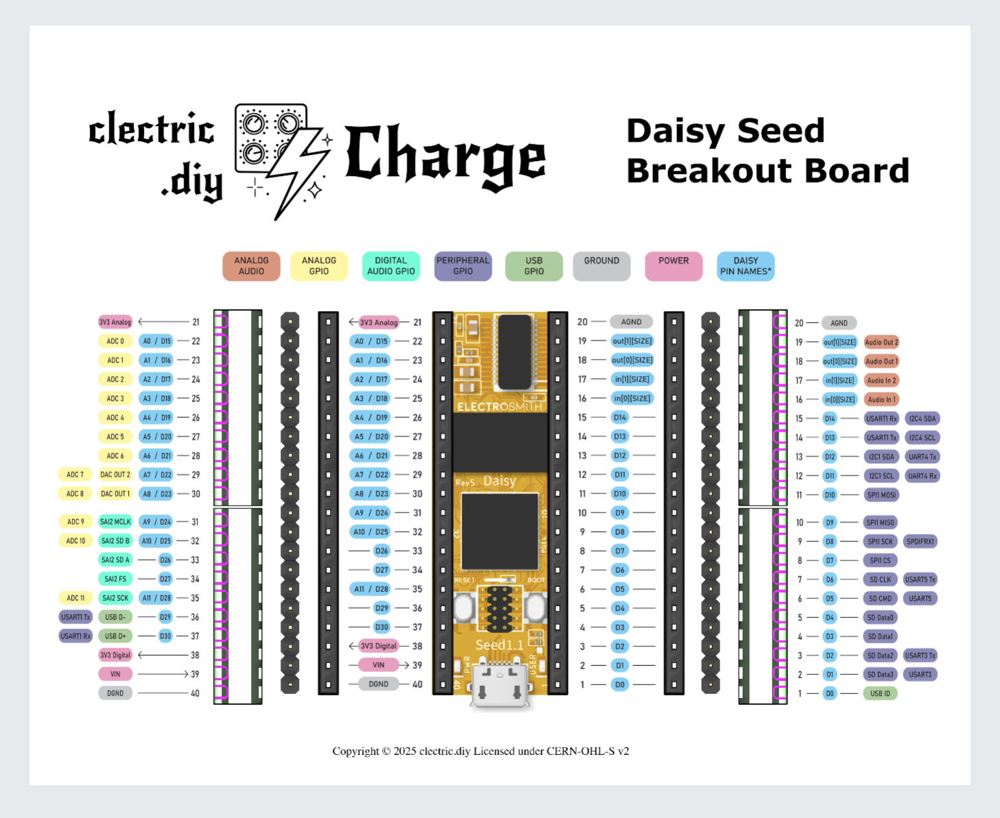
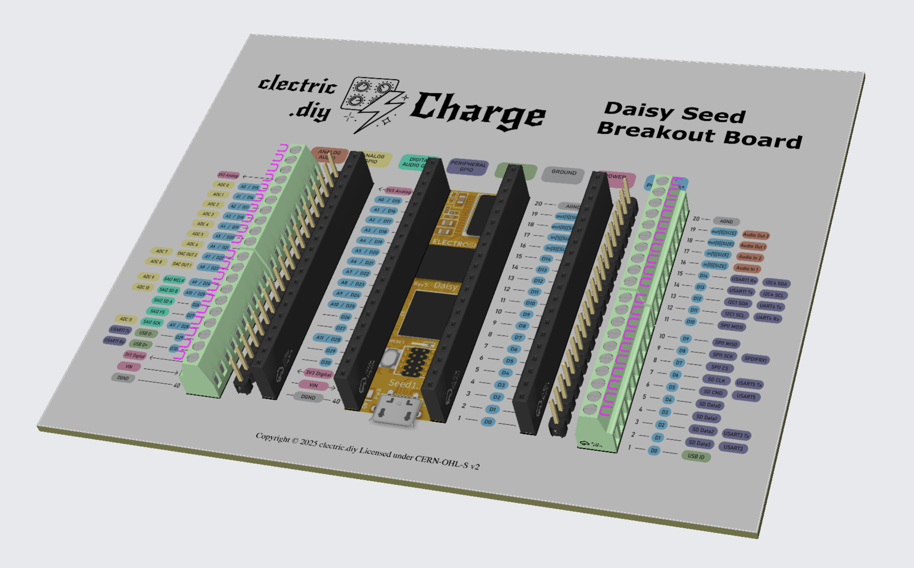

## Design
Our design goal is to create a breakout board that includes the pinout diagram so that you have the reference information that you need to work with the Daisy Seed.

## Prototype
We have just sent v0.1 of our _Charge Seed Breakout Board_ for production.

### 2D

### 3D

## Feedback
Constructive [feedback](https://github.com/orgs/clectric-diy/discussions/categories/charge-seed-q-a) is welcome!

## License
This project is open hardware under the [CERN-OHL-S](https://gitlab.com/ohwr/project/cernohl/-/wikis/uploads/b236492596cfc91c12def7d50bbf7da0/cern_ohl_s_v2.pdf) license.
